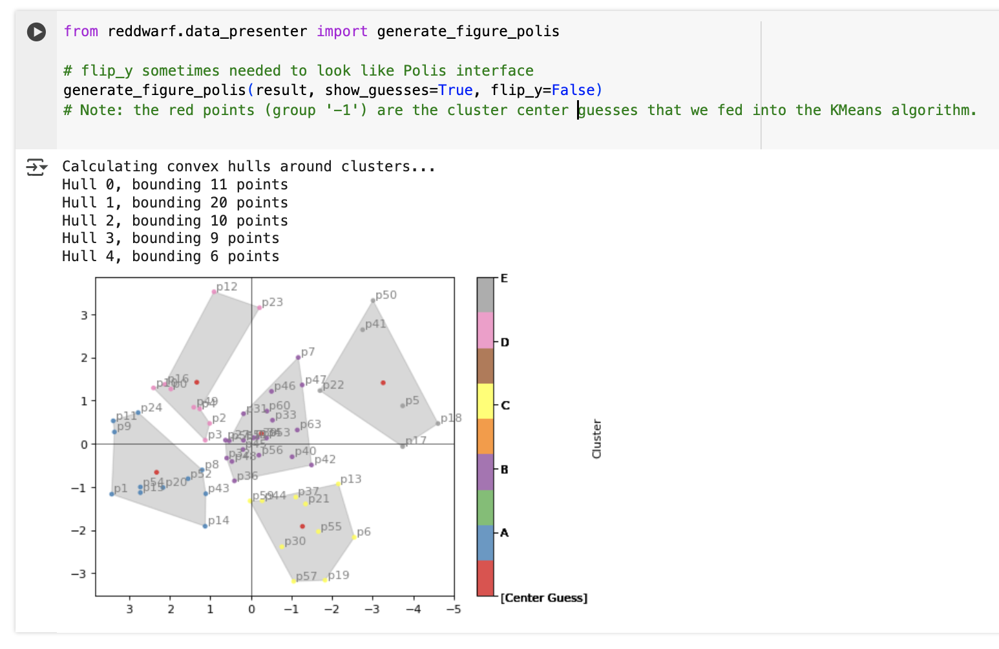

# Red Dwarf

[][pypi]
[](https://github.com/polis-community/red-dwarf-democracy/actions/workflows/test.yml)

A <em>DIM</em>ensional <em>RED</em>uction library for [stellarpunk][] democracy into the long haul.

> Stars are fires that burn for thousands of years. Some of them burn slow and
> long, like red dwarfs. Others-blue giants-burn their fuel so fast they shine
> across great distances, and are easy to see. As they start to run out of
> fuel, they burn helium, grow even hotter, and explode in a supernova.
> Supernovas, they're brighter than the brightest galaxies. They die, and
> everyone watches them go. -- Jodi Picoult, My Sister's Keeper

> If advanced alien civilizations really are out there, the planets of red
> dwarf stars could be ideal places to find them. -- [How the Universe Works
> (S5E8)](https://youtu.be/3Lq-mI6lgmA?t=375), Discovery

Inspiration: https://chatgpt.com/share/677f7690-7188-800b-85e5-816aaa7cc8f9

## Roadmap

For now, see [this related issue](https://github.com/patcon/red-dwarf/issues/4)

## Goals

Code that aspires to embody and support democratic values should be...

- **Legible.** It should be explorable and auditable not just to researchers, but to as many curious citizens as possible.
- **Re-usable.** It should be easily used in contexts in which its original creators did not anticipate, nor perhaps even desire.
- **Collectively stewarded.** It should grow and govern itself democratically and in a plural fashion.

## Sponsors

<p>
  <a href="https://agoracitizen.network" rel="noopener sponsored" target="_blank"></a>
</p>

Red Dwarf is generously sponsored by [ZKorum SAS](https://zkorum.com), creators of the [Agora Citizen Network](https://agoracitizen.network).

Are you or your organization eager to see more platforms and community built around democracy-supporting algorithms like these? **Please consider [getting in touch on Discord](#get-involved) and supporting our continued work!** (ping @patcon)

## Usage

See [`docs/notebooks/example-usage.ipynb`][notebook]

[][notebook]

### Loading Data

Let's say that you have a conversation for which you know the conversation url, and you may or may not know the report url. This conversation may also have an archived CSV export saved somewhere online.

- conversation url: https://pol.is/4yy3sh84js
   - `conversation_id`: `4yy3sh84js`
- report url: https://pol.is/report/r5jsvucnwuuhw7dzjvaim
   - `report_id`: `r5jsvucnwuuhw7dzjvaim`
- archived CSV export: https://github.com/compdemocracy/openData/tree/master/scoop-hivemind.ubi

```py
from reddwarf.polis import PolisClient

# If you only know the conversation ID, you can fetch the live data from the Polis APIs.
# Note that this may be fresher than a static export hosted elsewhere.
client = PolisClient()
client.load_data(conversation_id="4yy3sh84js")
# If you happen to know the report ID, that can be used instead.

# All of these are equivalent:
client.load_data(conversation_id="4yy3sh84js")
client.load_data(conversation_id="4yy3sh84js", data_source="api")
client.load_data(report_id="r5jsvucnwuuhw7dzjvaim")
client.load_data(report_id="r5jsvucnwuuhw7dzjvaim", data_source="api")

# If you know the report ID, you can also download from the newer and more official CSV export API endpoint:
# Example: https://pol.is/api/v3/reportExport/r5jsvucnwuuhw7dzjvaim/participant-votes.csv
client = PolisClient()
client.load_data(report_id="r5jsvucnwuuhw7dzjvaim", data_source="csv_export")

# All of these are equivalent:
client.load_data(report_id="r5jsvucnwuuhw7dzjvaim", data_source="csv_export")
client.load_data(directory_url="https://pol.is/api/v3/reportExport/r5jsvucnwuuhw7dzjvaim/")


# If you know a remote directory-like path that contains all the raw export files, you can use that.
# EXAMPLE
# Web: https://github.com/compdemocracy/openData/tree/master/scoop-hivemind.ubi
# Raw: https://raw.githubusercontent.com/compdemocracy/openData/refs/heads/master/scoop-hivemind.ubi/
#
# Note: you must tell the loader whether "strict moderation" is being used,
# as this can't be detected from the export data.
# The loader will look for files with these names:
#     - comments.csv
#     - votes.csv
client = PolisClient(is_strict_moderation=True)
client.load_data(directory_url="https://raw.githubusercontent.com/compdemocracy/openData/refs/heads/master/scoop-hivemind.ubi/")

# If you have local CSV files, you can also load them individually.
# Again, you must hint the moderation type.
# Filenames must match `*comments.csv` or `*votes.csv`
client = PolisClient(is_strict_moderation=True)
client.load_data(filepaths=[
   "your-data/comments.csv",
   "your-data/votes.csv",
])
```

## Get Involved

- [Join][pug-discord] the _Polis User Group (PUG)_ **Discord** server.
- Open a **GitHub issue**.
- Submit a **GitHub pull request**.
- Review the [**_Awesome Polis_ directory**][awesome-polis] to learn about related projects, academic papers, and other resources.
   - Use the _"People"_ section to find other individuals and groups working in the field.


## Changelog

See [`CHANGELOG.md`][changelog].

## License

[MPL 2.0: Mozilla Public License 2.0][mplv2] (See [`LICENSE`][license])

<!-- Links -->
   [pypi]: https://pypi.org/project/red-dwarf/
   [stellarpunk]: https://www.youtube.com/watch?v=opnkQVZrhAw
   [notebook]: https://github.com/polis-community/red-dwarf/blob/main/docs/notebooks/example-usage.ipynb
   [ZKorum]: https://github.com/zkorum
   [agora]: https://agoracitizen.network/
   [ngi-funding]: https://trustchain.ngi.eu/zkorum/
   [MPLv2]: https://choosealicense.com/licenses/mpl-2.0/
   [license]: https://github.com/polis-community/red-dwarf/blob/main/LICENSE
   [pug-discord]: https://discord.com/invite/wFWB8kzQpP
   [awesome-polis]: http://patcon.github.io/awesome-polis/
   [changelog]: CHANGELOG.md
